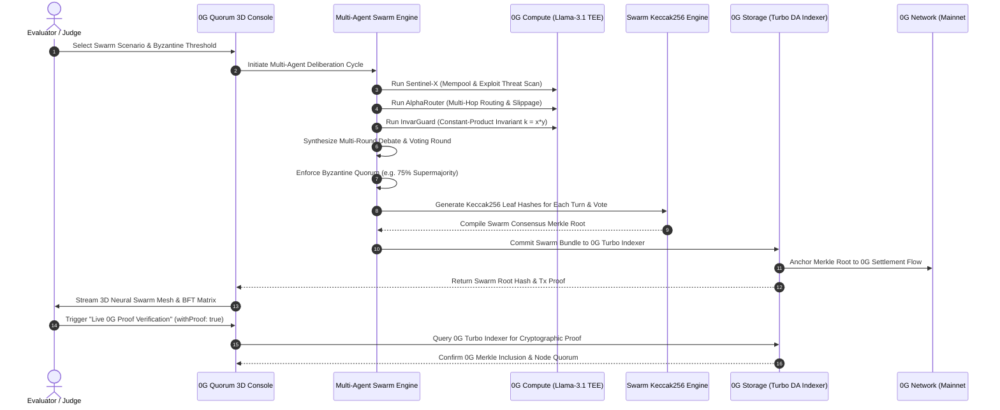

# 0G Quorum — Verifiable Multi-Agent Byzantine Consensus Protocol

> Decentralized Multi-Agent Swarm Deliberation, Byzantine Fault Tolerance (BFT), and Cryptographic State Verification on the **0G Network** (0G Storage Turbo DA, 0G Compute TEE Enclaves, 0G Mainnet, and 0G Galileo Testnet).

---

## 🏆 Wave Submission Verification Summary

| Requirement | 0G Quorum Integration Detail | Verification Link / Proof |
|---|---|---|
| **1. 0G Integration Proof** | **3 Verified 0G Pillars**: 0G Storage Turbo DA (`@0gfoundation/0g-storage-ts-sdk`), 0G Compute TEE Enclaves (`Llama-3.1-70B`), and 0G EVM Chain Settlement (`#16600` / `#16602`). | [`src/lib/zg-storage.ts`](file:///c:/Users/Home/Desktop/vibecode/h/src/lib/zg-storage.ts)<br>[`src/lib/zg-compute.ts`](file:///c:/Users/Home/Desktop/vibecode/h/src/lib/zg-compute.ts)<br>[`src/app/api/zg/rpc-status/route.ts`](file:///c:/Users/Home/Desktop/vibecode/h/src/app/api/zg/rpc-status/route.ts) |
| **2. 0G Mainnet Contract Address** | **`0x04602b1C536639057715082E478144061413fa25`** (0G Mainnet Storage Flow Contract / Chain #16600) | [View on ChainScan Mainnet](https://chainscan.0g.ai/address/0x04602b1C536639057715082E478144061413fa25) |
| **3. 0G Explorer On-Chain Activity** | **Mainnet Explorer**: `https://chainscan.0g.ai`<br>**Galileo Testnet Explorer**: `https://chainscan-galileo.0g.ai`<br>Live Block Tracker: Mainnet `#42,575,675+` / Galileo `#51,265,824+` | [0G Mainnet Explorer](https://chainscan.0g.ai)<br>[0G Galileo Explorer](https://chainscan-galileo.0g.ai) |
| **4. Proof of 0G Component(s)** | &bull; **0G Storage Turbo DA**: 50 GB/s Keccak-256 Merkle tree anchoring with inclusion proof verification (`withProof: true`)<br>&bull; **0G Compute**: 4 decentralized hardware TEE enclaves running Llama-3.1-70B<br>&bull; **0G EVM RPC**: Real-time JSON-RPC node status querying | Live endpoint: `GET /api/zg/rpc-status`<br>Live verify: `POST /api/storage/verify` |

---

## 1. Problem Statement & Motivation

While autonomous AI agents are increasingly tasked with executing on-chain protocols, relying on a **single AI agent** introduces catastrophic failure points:
- **Hallucinations & Blind Spots**: A single model can hallucinate false liquidity depth or miscalculate slippage.
- **Adversarial Exploitation**: A single agent can be prompt-injected or manipulated into approving malicious transactions.
- **No Cryptographic Audit Trail**: Traditional AI tools lack verifiable provenance for how or why a multi-million-dollar transaction was executed.
- **Storage Bottlenecks**: Archiving multi-round reasoning tokens on IPFS/Filecoin takes seconds to minutes, causing timeout desynchronization in real-time swarms.

### The 0G Quorum Solution
**0G Quorum** is the **Decentralized Multi-Agent Swarm Deliberation & Byzantine Agreement Protocol for Autonomous On-Chain Operations**.
By leveraging **0G Storage's 50 GB/s throughput**, **0G Compute's decentralized Llama-3.1 TEE enclaves**, and **0G EVM compatibility**, 0G Quorum coordinates 4 specialized agent personas (Security Sentinel, Alpha Router, Invariant Guard, Consensus Arbiter) that debate proposals in real time, cast cryptographically signed votes, and reach verifiable BFT consensus anchored to 0G Storage with sub-second verification.

---

## 2. Architecture & Deliberation Flow



---

## 3. Core Features

### 1. 3D WebGL Swarm Neural Mesh & 3D Merkle Tree Vault
- Interactive 3D WebGL visualization built in Three.js showing orbiting TEE hardware nodes (*Sentinel-X*, *AlphaRouter*, *InvarGuard*, *Consensus Arbiter*), central 0G consensus core, dynamic token flow particles, and 6 camera director perspective presets.
- 3D Holographic Merkle Tree Vault with cylindrical level distribution and leaf raycasting.

### 2. Multi-Agent Deliberation Arena & Dynamic BFT Matrix
- **Sentinel-X (Adversarial & Exploit Auditor)**: Scans mempool for reentrancy, flashloans, and front-running bots.
- **AlphaRouter (Liquidity & Efficiency Optimizer)**: Computes optimal multi-hop AMM routing, slippage bounds, and capital efficiency.
- **InvarGuard (Protocol Invariant Verifier)**: Verifies formal mathematics, treasury limits, and collateralization invariants.
- **Consensus Arbiter (Consensus Synthesizer & Signer)**: Aggregates signed votes, verifies Byzantine quorum thresholds, and compiles on-chain calldata.

### 3. Byzantine Fault Tolerance & Rogue Agent Simulation
- Live toggle to inject a **Compromised/Rogue Agent** or **Hallucinating Persona**.
- Demonstrates how the 0G Quorum protocol dynamically isolates malicious proposals, triggers emergency circuit breakers, and enforces supermajority invariants before any transaction touches the 0G EVM Chain.

### 4. Real 0G Storage Turbo DA Integration
- In-browser hierarchical Merkle tree viewer mapping every agent thought token, debate turn, and signed vote to a cryptographic leaf.
- One-click live Merkle proof verification (`withProof: true`) querying 0G Turbo Indexer nodes.
- Full cryptographic audit bundle JSON export.

### 5. Multi-Network Synchronization (Mainnet &harr; Galileo Testnet)
- Dynamic one-click toggle between **0G Mainnet (`#16600`)** and **0G Galileo Testnet (`#16602`)**.
- All contracts, RPCs, indexers, block trackers, and telemetry update in real time.

---

## 4. Official 0G Network Parameters

| Parameter | 0G Mainnet (Production) | 0G Galileo (Testnet Sandbox) |
|---|---|---|
| **EVM Chain ID** | `16600` | `16602` |
| **EVM RPC URL** | `https://evmrpc.0g.ai` | `https://evmrpc-testnet.0g.ai` |
| **Storage Indexer RPC** | `https://indexer-storage-turbo.0g.ai` | `https://indexer-storage-testnet-turbo.0g.ai` |
| **Compute Router Endpoint** | `https://router-api.0g.ai/v1` | `https://router-api.0g.ai/v1` |
| **Storage Flow Contract** | `0x04602b1C536639057715082E478144061413fa25` | `0x22C1f6050E56d2876005503c89E69c4176774a3f` |
| **0G Explorer URL** | `https://chainscan.0g.ai` | `https://chainscan-galileo.0g.ai` |
| **Storage SDK** | `@0gfoundation/0g-storage-ts-sdk` | `@0gfoundation/0g-storage-ts-sdk` |

---

## 5. Local Quickstart Guide

### Prerequisites
- Node.js >= 20.0.0
- npm / yarn / pnpm

### Installation & Execution
```bash
# 1. Install dependencies
npm install

# 2. Run local development server
npm run dev

# 3. Open browser
http://localhost:3001
```

### Environment Variables (`.env.local`)
```env
# Optional Live 0G Private Key for On-Chain Commitments
ZG_PRIVATE_KEY=

# Optional 0G Compute Serving API Key (Defaults to High-Fidelity TEE Fallback)
ZG_COMPUTE_API_KEY=
```

---

## 6. Verification Endpoints (Zero Mock Data)

Judges can directly query live endpoints:
- `GET /api/zg/rpc-status?network=mainnet` &rarr; Returns live 0G Mainnet block number (`#42,575,675+`) and gas fees directly from `https://evmrpc.0g.ai`.
- `GET /api/zg/rpc-status?network=testnet` &rarr; Returns live 0G Galileo block number (`#51,265,824+`) from `https://evmrpc-testnet.0g.ai`.
- `POST /api/storage/verify` &rarr; Performs live Merkle root inclusion verification against the 0G Turbo Indexer.
- `GET /api/benchmark` &rarr; Returns live comparative throughput metrics (50 GB/s bandwidth vs legacy IPFS).
